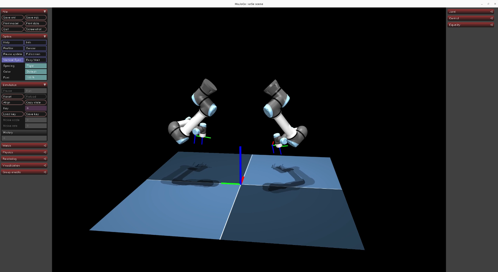
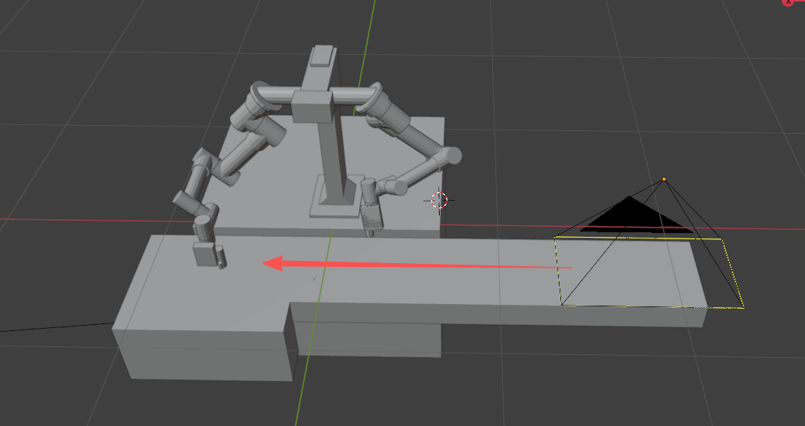
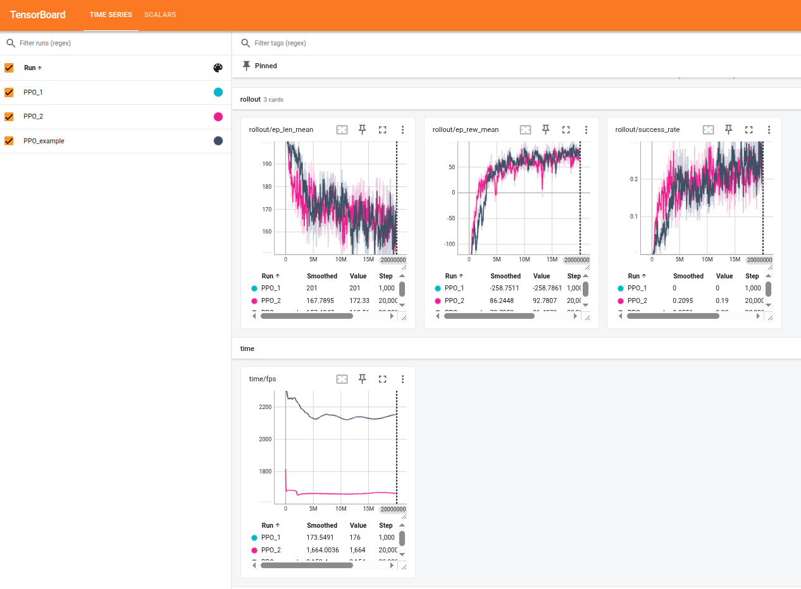
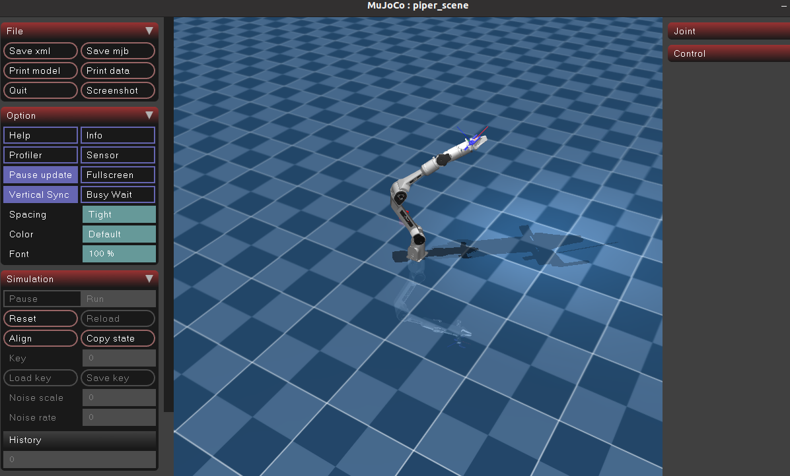
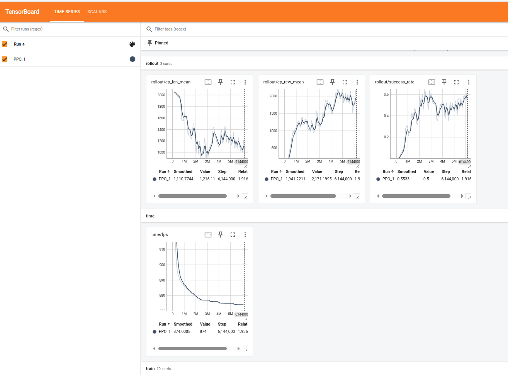
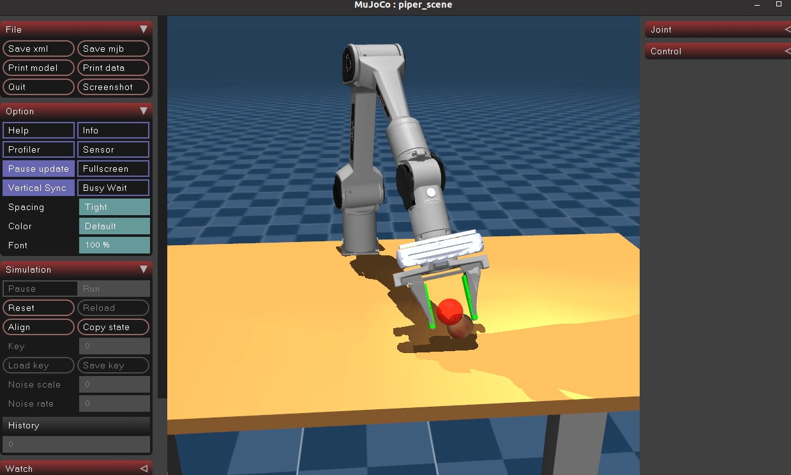

# 基于强化学习的机械臂抓取

## **环境配置**

```bash
$ conda create -n RL_test python=3.10.9
$ conda activate RL_test
$ pip install -r requirements.txt
$ pip install scipy tqdm rich
```
---
> ⚠️ **Note**
> 
> * 可视化训练不支持并行运行；并行训练需关闭可视化功能。
>
> * `--n_env` 参数可根据硬件性能调整并行环境数量，过大可能导致显存或内存不足
>

## Task 1：UR双臂机器人强化学习

### 任务描述：

基于UR双臂机器人描述文件`mujoco_asserts/universal_robots_ur5e`实现双臂的动态协作抓取



#### Step 1.在`mujoco_asserts/universal_robots_ur5e/scene_dual_arm.xml`基础上完善场景搭建

- reach目标物体高度一般距离机械臂基座800mm-900mm
- 抓取场景示意图，目标物体动态方向如图中所示
  - 

#### Step 2.在rl_policy下编写训练与评估代码rl_ur_train.py与rl_ur_test.py

- MDP 建模
  - 观测空间
  - 动作空间
  - 奖励函数设计

#### Step 3.课程学习

- 静态抓取
  - 目标物体速度设为 0
  - 目标物体随机出现在工作空间内，并且6DOF是双臂机器人末端可达的
  - **目标**：训练机器人学会 6DOF 对齐

- 慢速动态
  - 目标物体速度情况（例如 0.05 m/s）
  - 训练机器人学会“追踪”物体。此时网络需要利用输入的“物体速度”信息
- 双臂协同（可选）
  - 如果两个臂的工作空间重叠，需要在 Reward 中加入“互斥”惩罚，即：如果是左臂的目标物体，右臂靠近要扣分

### 任务提交：

请确保在本项目完成后，提交以下材料：

1. **项目实验报告**
   提交文档，内容应包括：

   * **训练过程曲线**：TensorBoard 训练效果截图，挑选你认为有意义的图像
   * **评估结果**：RL成功率
   * **推理分析**：思考并分析参数调整效果

   也可以提供代码与相关模型，用于评测

2. 主要完成**Task1**，可以参考Task2与Task3

---

## Task 2（可选）：基于 PPO 实现运动学逆解的强化学习训练

### Step 1. 完成 `rl_piper_ik_train.py` 的 `TODO` 部分，完成代码后运行以下命令训练

#### 方案1：可视化训练过程（实时查看训练过程，不能并行）

```bash
$ python rl_policy/rl_piper_ik_train.py --render --n_env 1
```
#### 方案2：并行训练（提高训练效率，无法实时查看）
```bash
$ python rl_policy/rl_piper_ik_train.py --n_env 100
```

训练完成后，将生成：

* 训练模型文件：`piper_ik_ppo_model.zip`
* 训练日志文件夹：`ppo_piper/`
  （项目中已提供 `piper_ik_ppo_model_example.zip` 与 `ppo_piper/PPO_example` 供参考）

### Step 2. 验证训练效果

**使用 TensorBoard 查看训练曲线：**

```bash
$ tensorboard --logdir ./ppo_piper --port 6006
```
  

**运行以下命令测试训练效果：**
```bash
$ python rl_policy/rl_piper_ik_test.py
```
  

---

## Task 3（可选）：基于 PPO 实现机械臂抓取的强化学习训练

### Step 1. 完成 `rl_piper_grasp_train.py` 的 `TODO` 部分，完成代码后运行以下命令以训练模型

```bash
$ python rl_policy/rl_piper_grasp_train.py --n_env <填入你设计的env数量>
```

>如需可视化训练，请添加 --render 参数

训练完成后会生成：

* 模型文件：`piper_grasp_ppo_model.zip`
* 对应的训练日志（保存在 `ppo_piper_grasp/` 目录下）

项目中已提供 `piper_grasp_ppo_model_example.zip` 与 `ppo_piper/PPO_grasp_example` 作为参考示例。

### Step 2. 验证训练效果

**使用 TensorBoard 查看训练曲线：** 
```bash
$ tensorboard --logdir ./ppo_piper_grasp --port 6006
```
  

**运行以下命令验证抓取策略效果：**
```bash
$ python rl_policy/rl_piper_grasp_test.py
```
  


---